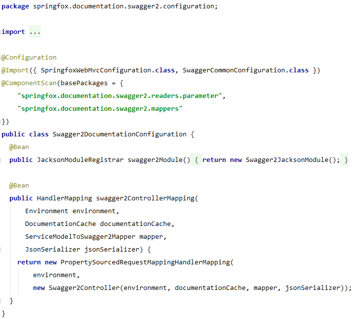

# spring-boot-demo

#### 介绍
spring boot项目模板 
环境：jdk-8u162 mysql-5.7.25 redis-5.0.4 zookeeper-3.4.13 kafka_2.11-2.0.1 
前端react项目地址：<a href="https://gitee.com/xuelingkang/react-demo" target="_blank">react-demo</a>
#### 安装说明
1. 在本地用VMware创建两台1核1G的centos7虚拟机，用户名和密码都是root，网络用NAT或桥接模式都可以
2. 在本地和虚拟机上的hosts文件中添加server01和server02，分别对应两台虚拟机的ip
3. 关闭防火墙
4. 安装zip unzip vim wget等
5. 在server02上创建demofile用户，密码为demo，用来保存附件
6. 在server01上安装jdk、nginx、redis(3个)，server02上安装jdk、nginx、mysql、zookeeper、zookeeper，版本号见介绍
7. mysql账号密码都是root，开启远程访问，创建demo数据库，导入resources/schema/demo.sql文件
8. redis密码设置为demo，配置sentinel
9. 服务器具体配置文件在centos7目录，文件位置根据安装位置确定
10. 开启邮箱授权，将邮箱账号和授权码分别填写在spring.mail.username和spring.mail.password

#### 基本功能
* 基础框架：spring-boot-2.1.3.RELEASE
>优点：敏捷开发，扩展方便
* web容器：jetty
>优点：轻量级 
应用：配置了access日志
* 数据源：druid
>优点：速度快，监控 
应用：配置了监控服务
* orm框架：mybatis-plus
>优点：减少重复编码量 
应用：继承并扩展了IBaseMapper IService ServiceImpl，增加泛型边界，增加了类似oracle的merge方法，并统一常用方法命名
* 缓存：redis
>优点：减少数据库访问量，提高响应速度 
应用：换用用户token和方法返回值
* 日志：logback
>优点：比log4j占用内存小且性能强 
应用：配置了日志分级别分包输出
* 定时任务：quartz
>优点：集群定时任务解决方案 
应用：预定义任务模板，自定义定时任务参数
* 认证授权框架：spring-security jwt websocket-security
>应用：实现前后分离请求认证，资源模块将http请求和websocket请求按照method和url保存起来，当用户发起请求时，通过授权决策器实现动态授权
* websocket
>应用：使用stomp子协议，继承并扩展了StompSubProtocolHandler，增加了对拦截器的支持，实现对SUBSCRIBE请求的动态授权，实现了群发消息和点对点消息
* 邮件：javax.mail
>应用：实现了群发和附件
* 参数校验：hibernate validation
>应用：支持@Validate（自定义分组校验）和@Valid（嵌套校验对象中的属性）注解，在全局异常处理中捕获校验异常，并封装返回值
* restful文档：swagger2
>优点：只需要配置注解即可动态生成文档 
应用：继承并扩展了ModelAttributeParameterExpander，增加了@IgnoreSwaggerParameter注解，用来隐藏不需要递归展开的属性
* swagger过滤器
>将spring-security的登录和登出url添加到文档中，
由于swagger通过springfox.documentation.swagger2.configuration.Swagger2DocumentationConfiguration的swagger2ControllerMapping方法将/v2/api-docs请求映射到Swagger2Controller 
 
Swagger2Controller不是spring容器中的bean，无法使用aop和拦截器，所以在过滤器中拦截了/v2/api-docs请求，将登录和登出动态添加到返回值中

#### 其他配置
* 使用kafka消息队列发送websocket消息
>支持服务集群部署
* 线程池和异步任务支持
>支持使用@Async定义异步任务
* fastjson
>比jackson速度快，统一配置了返回值格式，可以在字段上使用@JsonField进行个性化配置
* 全局跨域支持
>com.example.config.GlobalCorsConfig
* sftp
>实现了sftp连接池，sftp上传下载等功能

#### 博客主页
<a href="https://blog.csdn.net/qq_35433926" target="_blank">博客主页</a> 
如果我的代码对你有帮助，希望给我点个star，谢谢！
